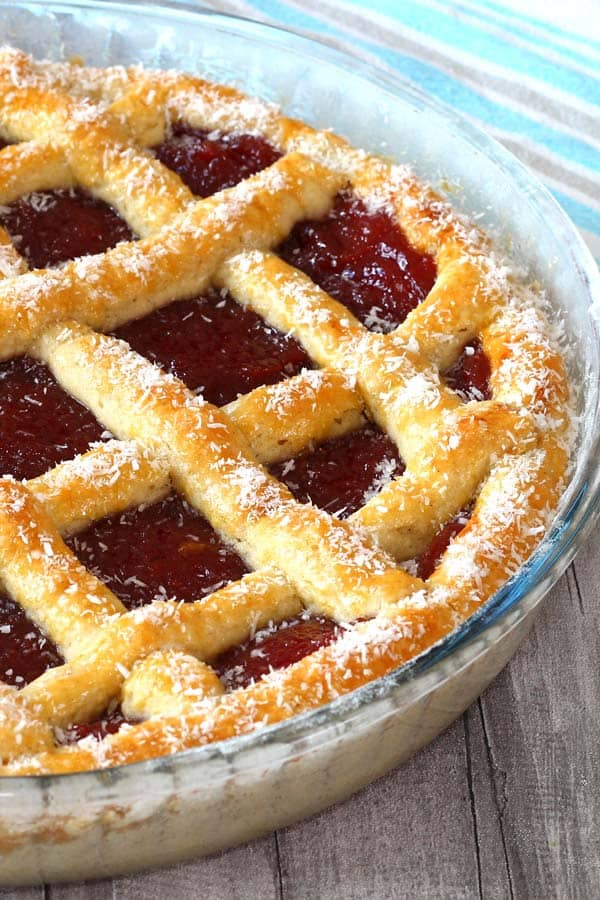
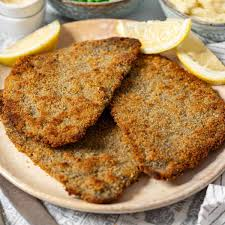
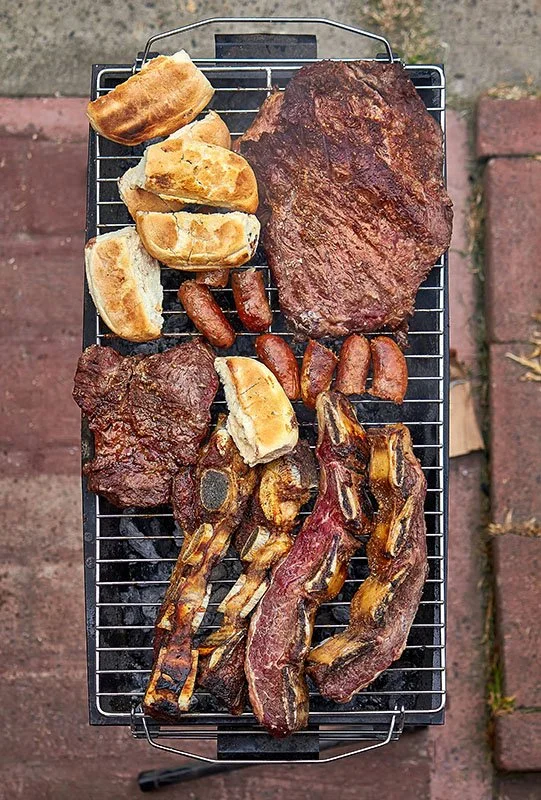

# Exercise_Unit5_website
En este repositorio encontrarás una web con información sobre comidas argentinas.
<!DOCTYPE html>
<html lang="es">
    <head>
        <title>Comidas argentinas</title>
        <meta charset="utf-8">
        <meta name="author" content="Gianna">
    </head>
    <body>
        <main>
            <h1>Comidas argentinas</h1>

             <h2>ÍNDICE</h2>
            <ol>
                <li><a href="#Introduccion">Introducción</a></li>
                <li><a href="#pastafrola">Pastafrola</a></li>
                <li><a href="#alfajor">Alfajor</a></li>
                <li><a href="#milanesa">Milanesa</a></li>
                <li><a href="#asado">Asado</a></li>

            </ol>
            <h2 id="#Introduccion">Introducción</h2>
            
Conoce la gastronomía argentina con nosotros; tanto carnes como postres. 

      
        <ol>
        <h2>Comidas</h2>
        <h3 id="pastafrola">Pastafrola</h3></id>
        
Pastafrola es una tarta artesanal típica de la gastronomía de Argentina, Paraguay y Uruguay. Su día internacional es el 18 de julio, se compone de una masa cubierta tradicionalmente con dulce de batata 
          o dulce de membrillo.

        
        <h3 id="alfajor">Alfajor</h3>
        
Un alfajor en Argentina es una golosina icónica compuesta por dos galletas unidas por un relleno dulce, que comúnmente es dulce de leche, aunque también puede ser mermelada, jalea u otros rellenos.

        
        <h3 id="milanesa">Milanesa</h3>
        
La milanesa es un filete, normalmente de carne vacuna; pero también puede ser de pollo o cordero empanado,  el cual se cocina frito o al horno.

        
        <h3 id="asado">Asado</h3>
        
En un típico asado argentino, además de la carne, se cocinan chorizos, morcillas, salchichas parrilleras y achuras como chinchulines, tripa gorda, mollejas...

        
        </ol>

    </body>
</html>
